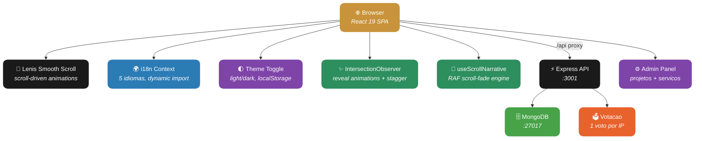

<div align="center">

# Luxview

**Agencia de tecnologia com landing page editorial, narrativa scroll-driven, sistema de votacao de projetos e i18n para 5 idiomas.**

[](https://react.dev)
[](https://vite.dev)
[](https://expressjs.com)
[](https://mongodb.com)
[](https://pnpm.io)
[](https://johnpitter.github.io/luxview/)
[](#license)

[Demo](https://johnpitter.github.io/luxview/) · [Features](#-features) · [Como Funciona](#-como-funciona) · [Tech Stack](#-tech-stack) · [Desenvolvimento](#-desenvolvimento)

</div>

---

## O que e o Luxview?

Luxview e o site institucional de uma agencia de tecnologia premium, construido como uma **single-page application** com narrativa scroll-driven e design editorial luxury. A pagina combina tipografia Playfair Display com acentos dourados sobre fundo claro/escuro (toggle), imagens com efeitos grayscale-to-color, e animacoes cinematograficas baseadas em scroll.

Alem do site, inclui um **sistema de votacao publica** onde a comunidade submete ideias de projeto — o mais votado do mes e desenvolvido gratuitamente pela Luxview.

**5 idiomas suportados**: Portugues, English, Espanol, 中文, 日本語.

---

## Features

| Categoria | O que voce encontra |
|---|---|
| **Scroll Narrative** | Secoes About e Values com animacao scroll-driven — textos aparecem e somem conforme o scroll |
| **Dark/Light Toggle** | Tema light como padrao com toggle para dark mode, preferencia salva em localStorage |
| **Projeto do Mes** | Sistema de votacao publica — envie ideias, vote nos favoritos, o mais votado ganha |
| **Anti-fraude** | 1 voto por IP por projeto, rate limiting em submissoes e votos |
| **i18n (5 idiomas)** | Portugues, Ingles, Espanhol, Chines e Japones — seletor com bandeiras SVG |
| **Portfolio Dinamico** | Projetos cadastrados via painel admin, exibidos em grid responsivo |
| **Areas de Atuacao** | Servicos customizaveis pelo admin com icon picker e tags |
| **Imagens Editoriais** | Hero com background full-screen, About com fotos side-by-side, Values com grayscale hover |
| **Reveal Animations** | Todas as secoes com fade-in, slide-up e stagger via IntersectionObserver |
| **Smooth Scroll** | Navegacao suave com Lenis, transicoes animadas entre secoes via menu |
| **SEO Completo** | Open Graph, Twitter Card, JSON-LD Organization, robots.txt, sitemap.xml |
| **Admin Panel** | Gerenciamento de projetos e servicos via `/admin` |
| **Responsivo** | Mobile-first com breakpoints em 768px e 1024px |

---

## Como Funciona



### Scroll Narrative Engine

O sistema de scroll-narrative usa `requestAnimationFrame` para atualizar opacidade, translateY e scale de elementos com base no progresso do scroll dentro de cada secao:

- Cada elemento recebe `data-scroll-fade="fadeIn,fadeOut"` com valores de 0 a 1
- O hook `useScrollNarrative` calcula o progresso e aplica transformacoes CSS
- Transicao de 0.06 de progresso para fade-in/out garante suavidade
- `will-change` otimiza performance, removido apos reveal

### Projeto Iluminado (Votacao)

1. Usuario acessa o site e scrolla ate "Projeto do Mes"
2. Envia sua ideia (nome, email, titulo, descricao)
3. Outros visitantes votam (upvote) — 1 voto por IP
4. Ao final do mes, o projeto mais votado e desenvolvido gratuitamente
5. Campanha de 12 meses = 12 projetos gratuitos

---

## Tech Stack

### Frontend (`@luxview/web`)

| Tecnologia | Uso |
|---|---|
| **React 19** | UI components e rendering |
| **Vite 7** | Build tool, dev server, HMR, code-splitting |
| **Lenis** | Smooth scroll e scroll-to animations |
| **Playfair Display** | Tipografia display serif (headings) |
| **Manrope** | Tipografia body sans-serif |
| **CSS Custom Properties** | Design tokens (cores, sombras, easing) |
| **IntersectionObserver** | Reveal animations e scroll-triggered effects |
| **i18n (custom)** | React Context + dynamic import para 5 idiomas |
| **GitHub Pages** | Deploy via GitHub Actions |

### Backend (`@luxview/server`)

| Tecnologia | Uso |
|---|---|
| **Express 5** | API REST para ideias e votacao |
| **Mongoose** | ODM para MongoDB |
| **express-rate-limit** | Protecao contra brute force |

### Infra

| Tecnologia | Uso |
|---|---|
| **pnpm workspaces** | Monorepo com 3 packages |
| **Docker Compose** | MongoDB containerizado |
| **MongoDB 7** | Persistencia de ideias e votos |
| **GitHub Actions** | CI/CD para deploy automatico |

---

## Desenvolvimento

### Pre-requisitos

- Node.js 20+
- pnpm 10+
- Docker (para MongoDB)

### Setup

```bash
# Clone
git clone https://github.com/JohnPitter/luxview.git
cd luxview

# Instale dependencias
pnpm install

# Suba MongoDB
docker compose up -d

# Dev server (frontend + backend)
pnpm dev
```

| Comando | O que faz |
|---|---|
| `pnpm dev` | Roda frontend (:5173) e backend (:3001) em paralelo |
| `pnpm dev:web` | Roda apenas o frontend |
| `pnpm dev:server` | Roda apenas o backend |
| `pnpm build` | Build de producao de todos os packages |
| `docker compose up -d` | Sobe MongoDB na porta 27017 |

### Variaveis de Ambiente

Crie `packages/server/.env` baseado no `.env.example`:

```
MONGODB_URI=mongodb://localhost:27017/luxview
PORT=3001
```

### Estrutura

```
luxview/
├── packages/
│   ├── web/                     @luxview/web — Frontend React
│   │   ├── src/
│   │   │   ├── components/
│   │   │   │   ├── Nav.jsx               Navegacao + theme toggle + i18n selector
│   │   │   │   ├── HeroSection.jsx       Hero com bg image e scroll narrative
│   │   │   │   ├── AboutSection.jsx      Manifesto com imagens editoriais
│   │   │   │   ├── ValuesSection.jsx     3 pilares com grayscale hover
│   │   │   │   ├── ServicesSection.jsx   Grid de servicos customizaveis
│   │   │   │   ├── IdeaSection.jsx       Projeto do Mes (votacao)
│   │   │   │   ├── SubmitIdeaModal.jsx   Modal de submissao de ideias
│   │   │   │   ├── ProjectsSection.jsx   Portfolio de projetos
│   │   │   │   ├── ContactSection.jsx    CTA com watermark editorial
│   │   │   │   ├── Footer.jsx            Rodape com links sociais
│   │   │   │   ├── ThemeToggle.jsx       Toggle dark/light mode
│   │   │   │   └── LanguageSelector.jsx  Seletor com bandeiras SVG
│   │   │   ├── hooks/
│   │   │   │   ├── useScrollNarrative.js    RAF scroll-fade engine
│   │   │   │   ├── useRevealAnimation.js    IntersectionObserver reveals
│   │   │   │   └── useTheme.js              Dark/light theme management
│   │   │   ├── i18n/
│   │   │   │   ├── index.jsx                Context + Provider + hook
│   │   │   │   └── locales/
│   │   │   │       ├── pt-BR.js             Portugues (default, sync)
│   │   │   │       ├── en.js                English (dynamic)
│   │   │   │       ├── es.js                Espanol (dynamic)
│   │   │   │       ├── zh.js                中文 (dynamic)
│   │   │   │       └── ja.js                日本語 (dynamic)
│   │   │   ├── pages/
│   │   │   │   ├── Home.jsx                 Landing page
│   │   │   │   └── Admin.jsx                Painel administrativo
│   │   │   └── styles/
│   │   │       └── global.css               Design system (light + dark)
│   │   └── vite.config.js
│   │
│   ├── server/                  @luxview/server — API Express
│   │   └── src/
│   │       ├── index.js                     Entry point
│   │       ├── models/
│   │       │   ├── Idea.js                  Schema de ideias
│   │       │   └── Vote.js                  Schema de votos (IP unico)
│   │       └── routes/
│   │           └── ideas.js                 CRUD + votacao + rate limit
│   │
│   └── shared/                  @luxview/shared — Constantes
│       └── constants.js                     Status, validacoes, limites
│
├── .github/workflows/deploy.yml             GitHub Pages CI/CD
├── docker-compose.yml                       MongoDB 7
├── pnpm-workspace.yaml                      Workspace config
└── package.json                             Scripts globais
```

---

## API

| Metodo | Rota | Descricao |
|---|---|---|
| `GET` | `/api/ideas` | Lista ideias do mes atual (ordenadas por votos) |
| `POST` | `/api/ideas` | Submete nova ideia |
| `POST` | `/api/ideas/:id/vote` | Vota em uma ideia (1 por IP) |
| `GET` | `/api/ideas/winners` | Historico de projetos contemplados |
| `GET` | `/api/health` | Health check |

---

## Design System

O tema usa CSS Custom Properties com dual-mode (light/dark):

| Token | Light | Dark |
|---|---|---|
| `--void` | `#fafaf9` | `#030303` |
| `--charcoal` | `#f0efe9` | `#0a0a0a` |
| `--white` | `#1a1a1a` | `#f4f4f5` |
| `--bone` | `#2a2a2a` | `#e5e5e5` |
| `--gold` | `#c8933a` | `#c8933a` |

**Tipografia**: Playfair Display (serif, headings) + Manrope (sans-serif, body)

**Efeitos**: Grayscale-to-color images, ambient orbs, scroll-fade narratives, stagger reveals

---

## i18n

5 idiomas suportados com code-splitting automatico:

| Idioma | Codigo | Carregamento |
|---|---|---|
| Portugues (Brasil) | `pt-BR` | Sincrono (default) |
| English | `en` | Dynamic import |
| Espanol | `es` | Dynamic import |
| 中文 (Chines) | `zh` | Dynamic import |
| 日本語 (Japones) | `ja` | Dynamic import |

Seletor com bandeiras SVG inline no nav. Preferencia salva em localStorage.

---

## License

MIT License - use livremente.
